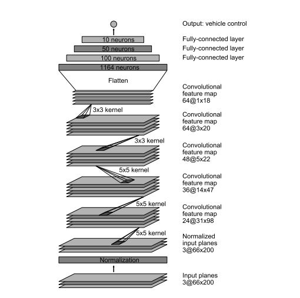

# Udacity Self-Driving Car Engineer Nanodegree - Behavioral Cloning Project

*Behavioral Cloning Porject - Udacity Self-Driving Car Engineer Nanodegree*

**Note: Udacity provided driving simulator and training data are used with this project!**

---

### Introduction
The idea is to train computer simulator to drive car based on data provided by Udacity. We apply the fundamentals of Deep Learning and CNNs (Convolutional Neural Networks) to train computer to drive car autonomously.

The data collected from Simulator is directly fed to model, the data here is images captured by 3 dashboard cameras that are left, right and center. The output contains data.csv that has mappings of left, right and center images and respective steer angles, throttles, brakes and speed. 

With Keras Deep learning framework model is saved as model.h5 that can be tested on simulator as "python drive.py model.h5". This drive.py connects model with simulator. The challenge here is to gather all types of training data to train the model to act as much correct in any condition as possible.

---

### Details on Files Submitted

#### 1. Submission Files

Following files are attached with the project:
* model.py - script to build and train the model
* drive.py - to drive car in autonomous mode
* model.h5 - trained keras convolution neural network 
* README.md - results summary
* video.mp4 - (recording of vehicle driving autonomously around the track)

#### 2.  Execution command

With Udacity simulator and drive.py file, you can drive car autonomously on track as below 
```sh
python drive.py model.h5
```

#### 3. Readable and Usable code

model.py is model code to build and train convolution neural network using keras framework. Script has CNN pipeline to train and validate model and properly commented code for readability.

---

## Model Architecture and Training


###  Model Overview

* As per Udacity suggestion, model is tested as the one given by NVIDIA. Model architecture is explained by NVIDIA [here](https://images.nvidia.com/content/tegra/automotive/images/2016/solutions/pdf/end-to-end-dl-using-px.pdf). This model takes input image as (60x266x3) but the training images are as (160x320x3). Architecture of model is kept same but image is converted to input shape as per Nvidia input image shape.



### Load Data 

* dataset provided by Udacity is used to train and validate
* OpenCV is used to load images, default OpenCV images are read in BGR format so it's converted to RGB as drive.py processes them in RGB.
* A correction factor for left and right images are used for steering angle is used.
* Correction factor of 0.2 is used same as in course content
* For left images the steering angle is increased by 0.2 and similarly, it's decreased by 0.2 for the right images.
* Sample Image


### Preprocess data

* Images are shuffled so order images come shouldn't matters to CNN neural network
* To augment data - same image is flipped as left to right and right to left and steering angles are adjusted accordingly, to flip the images openCV is used
* After flipping steer angle is multiplied by -1 to correct steer angle for flipped image
* With this operation, each entry in .csv file generates 6 images

### Train and Validation Set data

* Udacity dataset is split into train and validation with preprocessing sk-learn library
* Training dataset contains about 80% and Validation Set has remaining data
* Developed a generator utility to avoid loading all data in memory and rather generate them at run time with batch size as 32. 
* All images including augmented ones are generated with generator utility

### Final Architecture

* Original NVIDIA architecture is tweaked a little here
* From model summary, it's clear that first we do some pre-processing of image data
* Image is cropped with 50 pixels on top and with 20 pixels on bottom. As per the course suggestion, cropping from top helps model to avoid trees and sky and cropping from bottom helps remove dashboard that shows up in images.

Sample Input Image-
   

Cropped Image-


* 1. Next, first convolutional layer is defined as filter depth 24, size width x height = 5x5 with stride as (2,2) stride and ELU activation function
* 2. Next, second convolutional layer with depth as 36 and size width x height = 5x5 with stride as (2,2) and ELU activation function 
* 3. The third convolutional layer is filter depth as 48, size: width x height = 5x5 with stride (2,2) and ELU activation function
* 4. Next, two convolutional layers are defined as filter depth 64 and size: width x height = 3x3 with stride (1,1) and ELU activation funciton
* 5. Next layer flattens output
* 6. Next layer is fully connected layer with 100 result outputs
* 7. Next there is a Dropout with rate as 0.5 to avoid overfitting
* 8. Next fully connected layer is with 50 outputs
* 9. Then there is a third connected layer which outputs 10 values
* 10. The final layer has one output

Since, we have to predict only steer angle, so this has been shaped as a regression problem and only one output is needed in final layer


### Working with overfitting model

To generalize the model on an unknown track, a drop out is used and the drop out rate is set as 0.5 here. This has helped the model to avoid overfitting 

### Model parameter tuning

* Total epochs: 20
* Optimizer: Adam optimizer is used
* Learning Rate: 0.001 (default)
* TestValidation Data split: 0.2
* Generator batch-size: 32
* Correction factor: 0.2
* Loss Function: MSE (Mean Squared Error)


### Output Video
Output video is attached alongwith git repo and other required files
